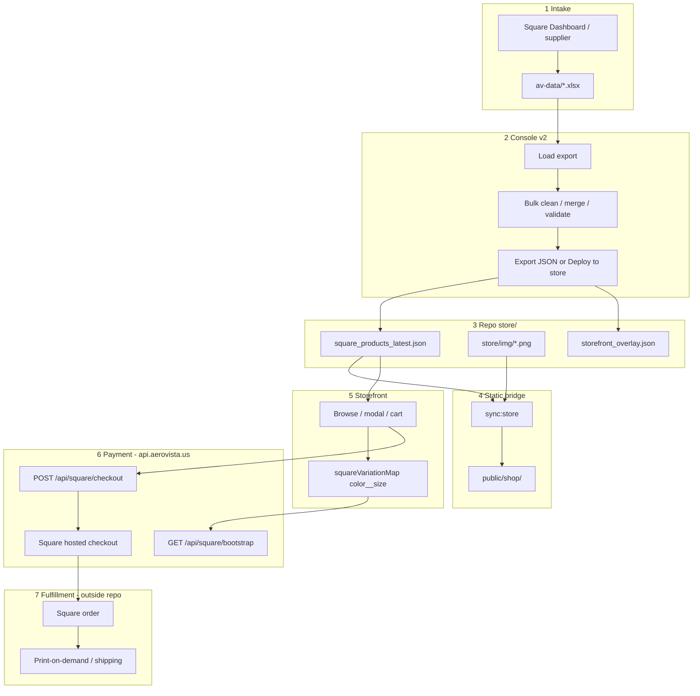

# SKU end-to-end audit — add product → ship

**Scope:** `av-store` static bridge + `api.aerovista.us` (backend not in this repo).  
**Date:** 2026-05-15

## Executive summary

The pipeline **works when Square’s export is complete** (each variant has **Token** = `variation_id` and **SKU**), console cleanup is deployed to `store/square_products_latest.json`, images live in `store/img/`, and **`api.aerovista.us`** has checkout mapping aligned with storefront **cart keys** (`{color}__{size}`).

The word **SKU is overloaded** in three ways — the main source of confusion and breakage.

| Label | Example | Where |
|-------|---------|--------|
| **Square merchant SKU** | `69B1C9EB37723_15898` | xlsx `SKU` → JSON `variants[].sku` |
| **Square variation ID** | `XF6WLKIXGAMT4B4LXBOX7OLZ` | xlsx `Token` → JSON `variants[].variation_id` |
| **Checkout cart key** (called `sku` in API) | `black__M` | Browser cart → POST `cart[].sku` |

Checkout uses **cart key** + **variationId**; it does **not** send merchant SKU in the hosted-checkout path.

---

## Flow diagram



---

## Stage-by-stage (follow the SKU)

### 1. Create product in Square (source of truth for payments)

- Create item + variations in **Square** (or supplier feed that syncs to Square).
- Each variation must have:
  - **SKU** (merchant SKU)
  - **Token** (Square catalog variation ID) — required for reliable checkout
- Export catalog `.xlsx` to `\\100.115.9.61\Collab\av-data\`.

**Gap:** New drafts in console (**+ New product draft**) have empty `sku` / `variation_id` until Square export is re-imported.

### 2. Console import (`console/aerovista_catalog_console_v2.html`)

| xlsx column | In-memory | Exported JSON |
|-------------|-----------|---------------|
| `SKU` | `variant.sku` | `variants[].sku` |
| `Token` | `variant.variation_id` | `variants[].variation_id` |

- Grouping: initially per **Item Name**; use **Bulk → Merge rows by product** for one card per style.
- Validation flags **duplicate merchant SKU** across products; does **not** flag missing `variation_id` on visible items (recommended addition).

### 3. Deploy (`npm run deploy:server` + **Deploy to store**, or `npm run deploy:catalog`)

- Writes `store/square_products_latest.json` (passthrough, no field renames).
- Optional `store/storefront_overlay.json`.
- Runs `sync-store` → `public/shop/`.

**Gap:** Forgetting `deploy:server` or manual JSON copy leaves shop stale.

### 4. Store catalog load (`store/index.html` → `loadProducts()`)

For each variant:

```text
idForCheckout = variation_id || sku
squareVariationMap["{color}__{size}"] = idForCheckout
```

- Product `id` in the shop is a **normalized name key**, not Square item id.
- Color casing in JSON must match UI dropdown (e.g. `black` vs `Black`).

### 5. Customer adds to cart

```text
cartSku = "{color}__{size}"   // NOT merchant SKU
localStorage key: av_store_cart_v3
```

### 6. Checkout

**POST** `https://api.aerovista.us/api/square/checkout`:

```json
{
  "cart": [{ "sku": "black__M", "variationId": "T2MH2Z6XNCZC4LPVSXZ7WX4B", "qty": 1 }],
  "currency": "USD"
}
```

- `sku` = cart key (`color__size`).
- `variationId` = value from `squareVariationMap` (usually Square Token).
- On **400**, message references server **`SQUARE_SKU_MAP_JSON`** — must stay aligned with cart keys (ops on NXCore, not in this repo).

**Gap:** In-page **Pay now** (`openPayOverlay`) sends the same shape but is **not wired** from the cart drawer; only **Checkout** (hosted redirect) is used.

**Gap:** Promo codes (`SEED10`, etc.) are **client-only**; not sent to checkout API.

### 7. Ship (post-payment)

- **Not implemented in `av-store`.** After Square hosted checkout, fulfillment is **Square orders + POD partner** (copy in UI: “Made-to-order via fulfillment partner…”).
- No order-tracking UI in static storefront; no webhook handlers in this repo.

---

## Checklist — new product go-live

1. [ ] Variation exists in **Square** with **SKU** + **Token**
2. [ ] Fresh **xlsx** in `av-data`
3. [ ] Console: load → merge → validate (no dup SKU, visible, price, image)
4. [ ] Image file in **`store/img/`** (exact filename in **Image filename**)
5. [ ] **Deploy to store** (or `deploy:catalog`) — confirms `store/` + `public/shop/`
6. [ ] Spot-check shop: product card, size/color, price, image
7. [ ] Test cart → checkout on staging/production API
8. [ ] Confirm backend map accepts cart key (if 400, fix `SQUARE_SKU_MAP_JSON` on API host)
9. [ ] Square dashboard: test order shows correct variation

---

## Risk register (priority)

| P | Risk | Mitigation |
|---|------|------------|
| P0 | Missing **Token** / `variation_id` on visible variant | Console validation rule; block deploy if any visible variant lacks `variation_id` |
| P0 | **color__size** mismatch (case/spelling) | Normalize color in `loadProducts` same as console; or case-insensitive map lookup |
| P1 | Backend **SQUARE_SKU_MAP_JSON** drift | Document cart keys in API repo; generate map from `square_products_latest.json` |
| P1 | Only updated `public/shop/img` not `store/img` | Always edit `store/img/` then `sync:store` |
| P2 | Stale cart after catalog regroup | Clear cart or version catalog + invalidate old carts |
| P2 | Hosted checkout vs token pay paths diverge | Wire one path or remove dead `openPayOverlay` |
| P3 | No post-checkout status in storefront | Square emails / AVCC orders surface (future) |

---

## Files reference

| Stage | Path |
|-------|------|
| Console | `console/aerovista_catalog_console_v2.html` |
| Catalog JSON | `store/square_products_latest.json` |
| Overlay | `store/storefront_overlay.json` |
| Storefront | `store/index.html` |
| Deploy lib | `scripts/lib/deploy-store.mjs` |
| Pipeline doc | `docs/CATALOG_PIPELINE.md` |
| API | `https://api.aerovista.us` — `/api/square/bootstrap`, `/api/square/checkout` |

---

## Recommended next engineering steps

1. Console: validation **`missing_variation_id`** for visible variants.
2. Store: case-insensitive `squareVariationMap` lookup (or normalize colors at load).
3. API repo: document/generate `SQUARE_SKU_MAP_JSON` from deployed catalog JSON.
4. Optional: pre-deploy script that fails if any visible product lacks `variation_id` or image file on disk.
